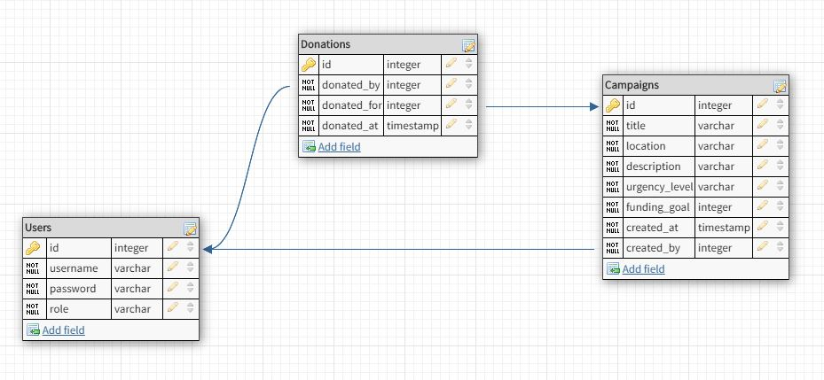

## Endpoints

-  ### Base URL: https://bw-save-the-animals.herokuapp.com
-  # _Login and register_

| Method |         URL          |                                              Description |
| :----- | :------------------: | -------------------------------------------------------: |
| POST   |  **`/auth/login`**   |                   User login, returns username and token |
| POST   | **`/auth/register`** | User registration, returns new user's username and token |

_Example response:_

```
 {
     "uid": integer, (user ID)
     "message": string,
     "token": JWT
 }
```

-  # _Campaigns_

| Method |         URL          |                                 Description |
| :----- | :------------------: | ------------------------------------------: |
| GET    | **`/campaigns/:id`** | Find campaign by ID with array of donations |

_Example response:_

```
{
   "id": integer,
   "title": string,
   "location": string,
   "description": string,
   "urgency": string, ("low", "medium", or "high")
   "funding_goal": integer,
   "created_at": datetime,
   "created_by": string, (username)
   "total_donations": [
    {
     "donation": integer,
     "donated_at": datetime,
     "donated_by": string (username)
    },
    {
     "donation": integer,
     "donated_at": datetime,
     "donated_by": string (username)
    }
  ]
}
```

| Method |        URL        |                               Description |
| :----- | :---------------: | ----------------------------------------: |
| GET    | **`/campaigns/`** | Get all campaigns with array of donations |

_Example response:_

```
[
  {
    "id": integer,
    "title": string,
    "location": string,
    "description": string,
    "urgency": string, ("low", "medium", or "high")
    "funding_goal": integer,
    "created_at": datetime,
    "created_by": integer (user ID)
  },
  {
    "id": integer,
    "title": string,
    "location": string,
    "description": string,
    "urgency": string, ("low", "medium", or "high")
    "funding_goal": integer,
    "created_at": datetime,
    "created_by": integer (user ID)
  },
  {
    "id": integer,
    "title": string,
    "location": string,
    "description": string,
    "urgency": string, ("low", "medium", or "high")
    "funding_goal": integer,
    "created_at": datetime,
    "created_by": integer (user ID)
  }
]
```

| Method |           URL           |                    Description |
| :----- | :---------------------: | -----------------------------: |
| POST   | **`/campaigns/search`** | Search for a campaign by title |

_*Required:*_

```
{
	"title": string ( case insensitive )
}
```

_Example response:_

```
{
  "id": integer,
  "title": string,
  "location": string,
  "description": string,
  "urgency": string, ("low", "medium", or "high")
  "funding_goal": integer,
  "created_at": datetime,
  "created_by": integer (user ID)
}
```

| Method |        URL        |      Description |
| :----- | :---------------: | ---------------: |
| POST   | **`/campaigns/`** | Add new campaign |

_*Required:*_

```
{
  "title": string,
  "location": string,
  "description: string,
  "urgency": string, ("low", "medium", or "high")
  "funding_goal": integer,
  "created_by": integer (user ID)
}
```

_Example response:_

```
{
  "id": integer,
  "title": string,
  "location": string,
  "description": string,
  "urgency": string, ("low", "medium" or "high")
  "funding_goal": integer,
  "created_at": datetime,
  "created_by": string, (username)
  "total_donations": [
    {
      "donation": integer,
      "donated_at": string,
      "donated_by": string
    }
  ]
}
```

| Method |         URL          |   Description |
| :----- | :------------------: | ------------: |
| PUT    | **`/campaigns/:id`** | Edit campaign |

### **Must be creator of campaign to edit it**

```
{
    (optional) "title": string,
    (optional) "location": string,
    (optional) "description": string,
    (optional) "urgency": string, ("low", "medium", or "high")
    (optional) "funding_goal": integer
}
```

| Method |         URL          |          Description |
| :----- | :------------------: | -------------------: |
| DELETE | **`/campaigns/:id`** | Delete project by ID |

### **Must be creator of campaign to delete it**

_Example response:_ `1`

-  # _Donations_

| Method |         URL          |                      Description |
| :----- | :------------------: | -------------------------------: |
| GET    | **`/donations/:id`** | Get all donations by campaign ID |

_Example response:_

```{
  "total": integer,
  "donations": [
    {
      "amount": integer,
      "donated_by": string, (username)
      "donated_at": datetime
    },
    {
      "amount": integer,
      "donated_by": string, (username)
      "donated_at": datetime
    }
  ]
}
```

# Get all donations by user ID

| Method |         URL          |                  Description |
| :----- | :------------------: | ---------------------------: |
| GET    | **`/donations/:id`** | Get all donations for a user |

_Example response:_

```
[
  {
    "id": integer,
    "amount": integer,
    "donated_at": datetime
  },
  {
    "id": integer,
    "amount": integer,
    "donated_at": datetime
  }
]
```

| Method |         URL          |        Description |
| :----- | :------------------: | -----------------: |
| POST   | **`/donations/:id`** | Add a new donation |

_*Required:*_

```
{
  "donated_by": integer, (user ID)
	"donated_for": integer,
	"donation_amount": integer
}
```

_Example response:_

```
{
  "id": 14,
  "donated_by": integer,
  "donated_for": integer,
  "donation_amount": integer,
  "donated_at": "2020-02-02T23:11:30.540Z"
}
```

| Method |         URL          |     Description |
| :----- | :------------------: | --------------: |
| DELETE | **`/donations/:id`** | Delete donation |

_Example response:_ `1`

#### DB Schema:


